# Compile guide

1. [Software install](#software)
2. [Compiling](#compiling)

This only supports compiling on windows as of 3rd of april 2024

### Software
You will need
- .NET 5.0 sdk [x64](https://dotnet.microsoft.com/en-us/download/dotnet/thank-you/sdk-5.0.408-windows-x64-installer) [x86](https://dotnet.microsoft.com/en-us/download/dotnet/thank-you/sdk-5.0.408-windows-x86-installer)
- Visual studio 2019 [Link](https://my.visualstudio.com/Downloads?q=visual%20studio%202019&wt.mc_id=o~msft~vscom~older-downloads)
- MOSA Compiler tools [Link](https://github.com/Dell-Optiplex-390/MOSA-Core) (Download all files)
- [VirtualBox](https://www.virtualbox.org/wiki/Downloads) or [VMware player](https://www.vmware.com/content/vmware/vmware-published-sites/us/products/workstation-player/workstation-player-evaluation.html.html)

Launch the .NET 5.0 installer and click "Install"

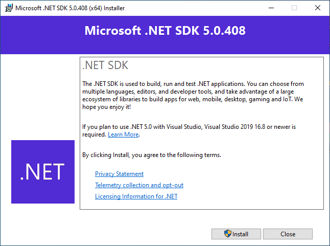

Then click "Close" after its installed

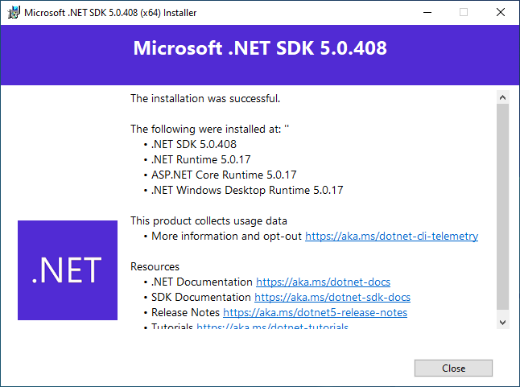

Now launch the Visual Studio 2019 installer and click "Continue"

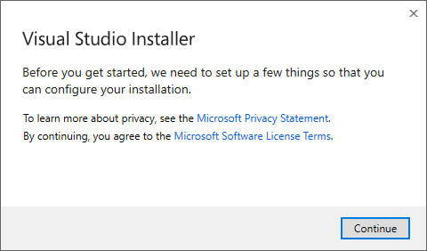

Select ".NET desktop development" and "Desktop development with c++" and click install

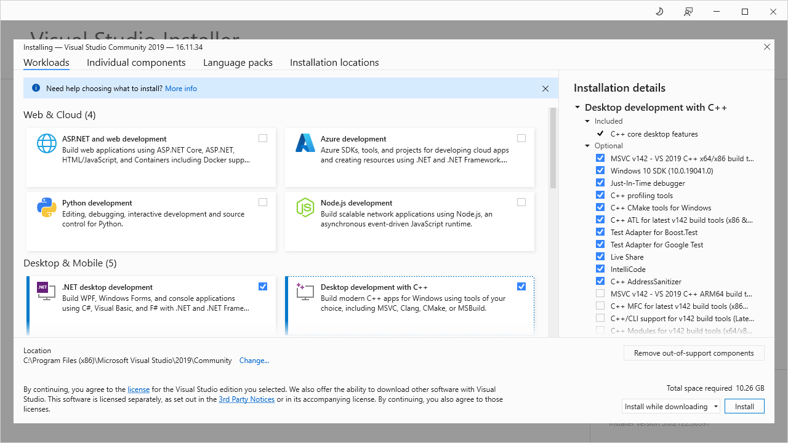

After its installed close the installer

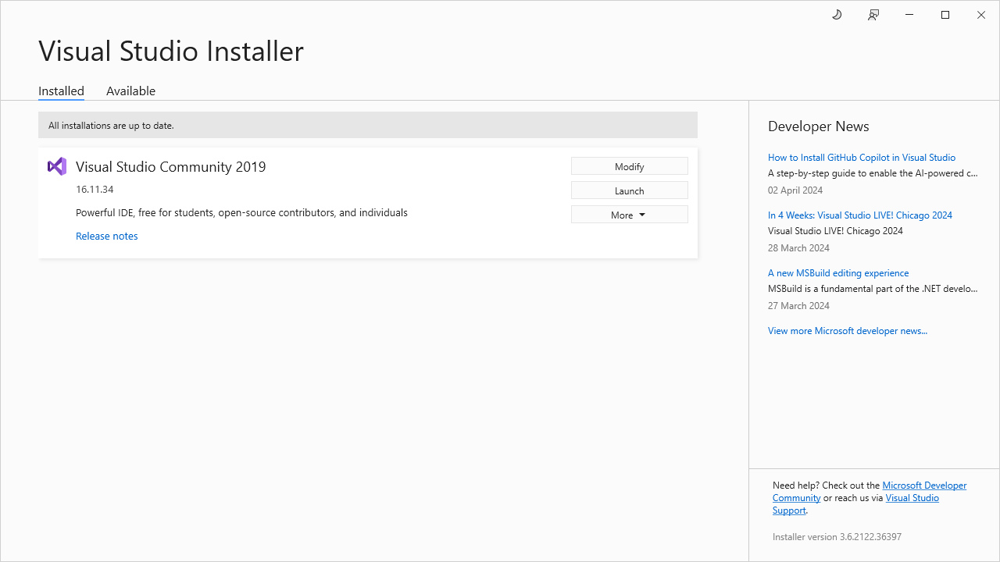

Click "Not now, Maybe later" if you wont want to login

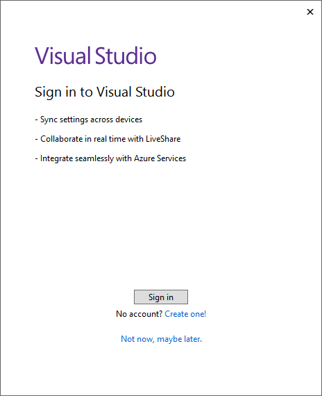

Now close Visual Studio and launch the VirtualBox installer or VMware installer

Click "Next"

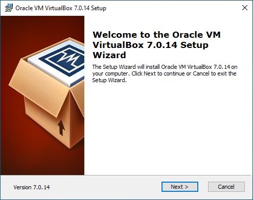

Click "Next" again

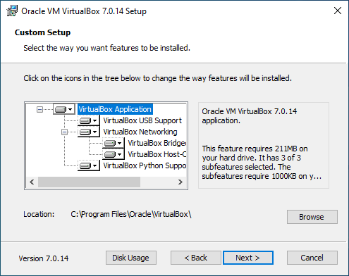

Click "Yes"

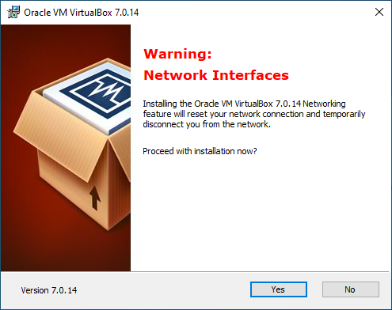

Click "Yes" again

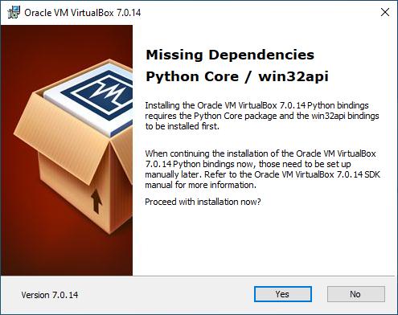

Uncheck "Start Oracle VM VirtualBox after installation" and click "Finish"

Extract the MOSA Compiler tools and run "Install.bat" as admin

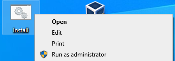

When it asks "Select the desired task" type "install" and hit enter

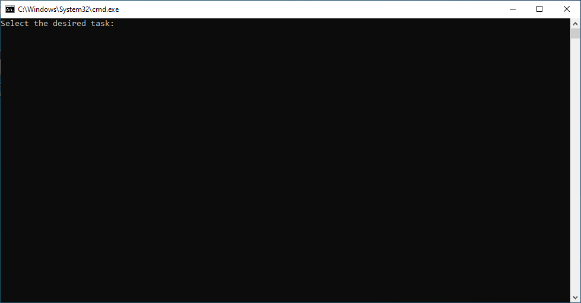

### Compiling
